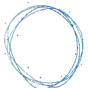

<h1 align="center">🎨 Huzaifa Frontend</h1>

<h3>Frontend Development | Modern Web Technologies | Interactive UI/UX</h3>

*A comprehensive collection of frontend projects showcasing modern web development practices, responsive design patterns, and cutting-edge user experiences.*

---

## 🚀 About This Organization

Welcome to my frontend development showcase! This organization represents my journey through modern frontend technologies, from static websites and popular platform clones to sophisticated React applications. Each project demonstrates different aspects of contemporary web development, emphasizing clean code architecture, responsive design, and exceptional user experiences.

---

## 🛠️ Technologies & Tools

<h3 align="left">Core Languages:</h3>

  
  
  
  

<h3 align="left">Frameworks & Libraries:</h3>

  
  
  
  

<h3 align="left">Styling & UI Libraries:</h3>

  
  
  
  
  
  

<h3 align="left">Build Tools & Development:</h3>

  
  
  
  

<h3 align="left">Animation & Interactive Elements:</h3>

  
  
  

<h3 align="left">Form Handling & Validation:</h3>

  
  

---

## 📂 Featured Projects

### 🍋 **Little Lemon App**
> **A complete Mediterranean restaurant web application with modern UX**
- **Features**: Interactive menu system, table booking, responsive design
- **Tech Stack**: React, Material UI, Form validation, Responsive layouts
- **Highlights**: Smooth animations, accessibility features, mobile-first approach
- **Live Demo**: [little-lemon-app-indol.vercel.app](https://little-lemon-app-indol.vercel.app/)
- [**🔗 View Repository**](https://github.com/huzaifa-frontend/little-lemon-app)

---

### 💼 **React Portfolio Practice**
> **Professional developer portfolio showcasing modern React patterns**
- **Features**: Clean design, interactive animations, contact form validation
- **Tech Stack**: React, Formik, Yup validation, Framer Motion
- **Highlights**: Performance optimized, SEO-friendly, cross-browser compatible
- **Live Demo**: [react-portfolio-practice-theta.vercel.app](https://react-portfolio-practice-theta.vercel.app/)
- [**🔗 View Repository**](https://github.com/huzaifa-frontend/react-portfolio-practice)

---

### ⚡ **Vite React Counter**
> **Modern counter application demonstrating React best practices**
- **Features**: Dark/Light mode, localStorage persistence, smooth animations
- **Tech Stack**: Vite, React, Tailwind CSS, React Hooks
- **Highlights**: Lightning-fast build times, optimized bundle size, modern tooling
- **Live Demo**: [vite-react-counter-iota.vercel.app](https://vite-react-counter-iota.vercel.app/)
- [**🔗 View Repository**](https://github.com/huzaifa-frontend/vite-react-counter)

---

### 🛍️ **TechStoreX**
> **Interactive e-commerce demo with advanced JavaScript features**
- **Features**: Product filtering, shopping cart, dynamic UI interactions
- **Tech Stack**: Vanilla JavaScript, CSS3, DOM manipulation
- **Highlights**: No framework dependencies, efficient algorithms, clean architecture
- **Live Demo**: [huzaifa-frontend.github.io/techstorex-javascript](https://huzaifa-frontend.github.io/techstorex-javascript/)
- [**🔗 View Repository**](https://github.com/huzaifa-frontend/techstorex-javascript)

---

### 🌐 **Static Sites & Platform Clones Collection**
> **Pixel-perfect recreations of popular platforms and custom designs**

**Featured Clones:**
- **Foodpanda Clone** - Complete food delivery interface with ordering flow
- **Apple Website Clone** - Product showcase with smooth scrolling animations  
- **OFFMENU Clone** - Restaurant discovery platform with search functionality
- **Various Landing Pages** - Business, portfolio, and marketing page designs

**Tech Focus**: HTML5, CSS3, Bootstrap, responsive design, cross-browser compatibility

---

## 📈 Frontend Development Categories & Skills Demonstrated

| **Category** | **Projects** | **Key Skills** |
|---|---|---|
| **🎨 UI/UX Focus** | Portfolio sites, Landing pages | Design systems, Typography, Color theory |
| **⚛️ React Applications** | Little Lemon, Portfolio, Counter | Hooks, State management, Component patterns |
| **🎪 Interactive Elements** | All projects | Animations, Transitions, User feedback |
| **📱 Responsive Design** | Every project | Mobile-first, Flexbox, Grid layouts |
| **🔧 Modern Tooling** | Vite projects, Webpack builds | Build optimization, Development workflow |
| **🏗️ Architecture** | Larger applications | Code organization, Reusable components |

---

## 🌟 What Makes These Projects Special

- ✅ **Production-Ready Code** - Clean, well-documented, maintainable
- ✅ **Modern Best Practices** - Latest React patterns, ES6+, TypeScript
- ✅ **Performance Optimized** - Lazy loading, code splitting, efficient rendering
- ✅ **Accessibility First** - WCAG guidelines, semantic HTML, keyboard navigation
- ✅ **Responsive Design** - Works beautifully on all devices and screen sizes
- ✅ **Interactive & Engaging** - Smooth animations, intuitive user interactions

---

## 🎓 Learning & Innovation

### **Modern Frontend Mastery**
- **React Advanced Patterns** - Custom hooks, compound components, render props
- **Performance Optimization** - Code splitting, lazy loading, memoization techniques
- **State Management** - Context API, Redux patterns, Zustand integration
- **Type Safety** - TypeScript advanced patterns, strict typing, error prevention

### **CSS & Styling Excellence**
- **Modern CSS Features** - Grid, Flexbox, Container queries, CSS custom properties
- **Design Systems** - Component libraries, design tokens, consistent theming
- **Animation & Motion** - CSS transitions, Framer Motion, micro-interactions
- **Responsive Mastery** - Mobile-first approach, breakpoint strategy, fluid design

### **Developer Experience & Tooling**
- **Build Tools Mastery** - Vite optimization, Webpack configuration, bundle analysis
- **Code Quality** - ESLint rules, Prettier formatting, automated testing
- **Version Control** - Git workflows, branching strategies, collaborative development
- **Deployment** - CI/CD pipelines, performance monitoring, error tracking

### **User Experience & Accessibility**
- **Accessibility Standards** - WCAG compliance, screen reader optimization, keyboard navigation
- **Performance Metrics** - Core Web Vitals, lighthouse optimization, loading strategies
- **Cross-Browser Testing** - Compatibility testing, progressive enhancement, feature detection
- **User Interface Psychology** - Color theory, typography hierarchy, visual design principles

---

## 🤝 Collaboration & Learning

I'm passionate about frontend development and always eager to:

- **🔍 Code Reviews** - Provide feedback and learn from others
- **🚀 Open Source** - Contribute to community projects
- **📚 Knowledge Sharing** - Write about frontend best practices
- **🤝 Mentorship** - Help junior developers grow their skills
- **💡 Innovation** - Experiment with new technologies and patterns

---

## 📬 Let's Connect

**Professional Inquiries**: [karimhuzaifa590@gmail.com](mailto:karimhuzaifa590@gmail.com)  
**LinkedIn**: [Muhammad Huzaifa Karim](https://www.linkedin.com/in/muhammad-huzaifa-karim-590k)  
**Main Profile**: [@huzaifakarim1](https://github.com/huzaifakarim1)

---

### 🌟 Explore My Complete Development Journey

---

*Transforming ideas into sleek, responsive, and interactive designs* ✨

<!-- Footer -->

